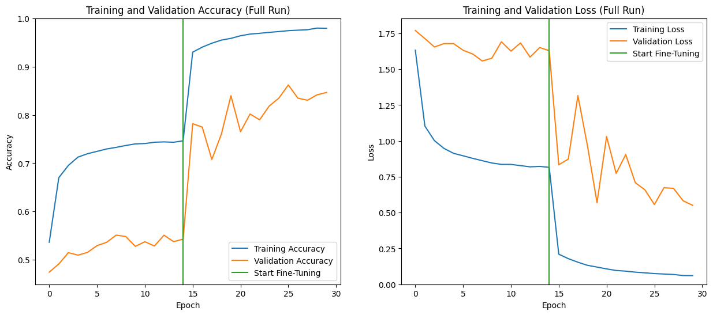
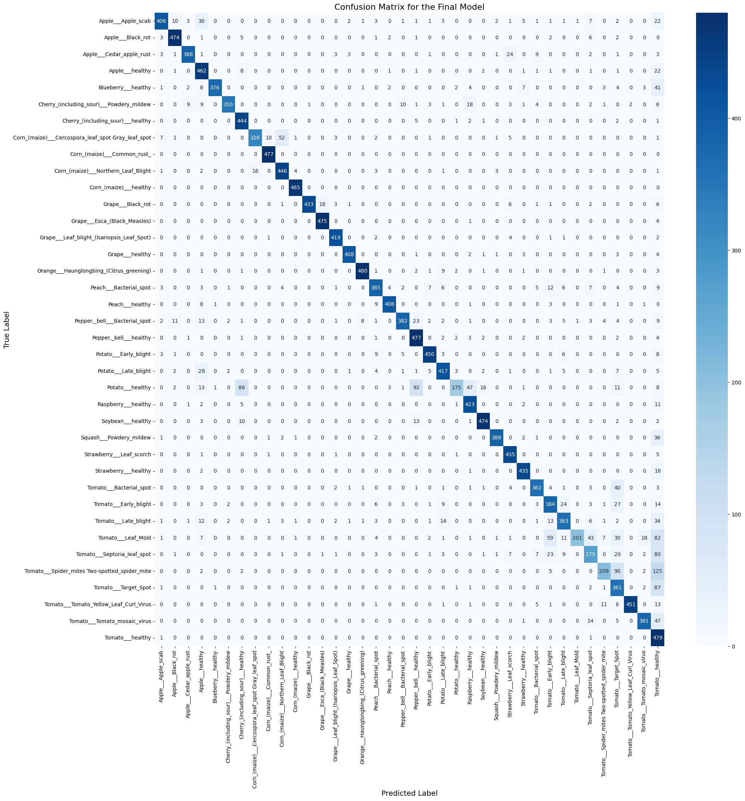

# 🌿 Plant Disease Detection System

A deep learning project to automatically diagnose 38 different types of plant diseases from leaf images. The final model is deployed as an interactive web application using Streamlit.

## ⚙️ Project Workflow

This project is an end-to-end deep learning pipeline for image classification. The workflow consists of the following key stages:

1.  **Data Acquisition & Preparation:** The model is trained on the **New Plant Diseases Dataset (Augmented)**, a large public dataset containing over 70,000 images across 38 distinct classes of healthy and diseased plant leaves. The data is loaded and processed using `tf.data` pipelines for maximum efficiency.

2.  **Model Architecture:** The core of the project utilizes **Transfer Learning**. A powerful, pre-trained Convolutional Neural Network (CNN), **MobileNetV2** ,serves as the feature extraction backbone. On top of this frozen base, a custom classifier head was added, consisting of a `GlobalAveragePooling2D` layer, a `Dropout` layer for regularization, and a final `Dense` layer with `softmax` activation to predict the 38 classes. The entire model was built using the Keras Functional API for robustness.

3.  **Training & Fine-Tuning:** The model was trained in two phases on a cloud TPU/GPU for maximum speed:
    * **Initial Training:** The custom classifier head was trained for 15 epochs while the base model remained frozen.
    * **Fine-Tuning:** The later layers of the base model were unfrozen and the entire model was trained for another 15 epochs with a very low learning rate. This critical step allowed the model to adapt its feature detectors to the specific details of plant leaves, significantly boosting performance.

4.  **Deployment:** The final, high-performance model was saved and deployed as an interactive web application using **Streamlit**. The application provides a simple user interface for users to upload a leaf image and receive an instant, real-time diagnosis and confidence score.

## Table of Contents
- [Problem Statement](#problem-statement)
- [Dataset](#dataset)
- [Model Architecture](#model-architecture)
- [Results](#results)
- [Technologies Used](#technologies-used)
- [Setup and Usage](#setup-and-usage)

## 📝 Problem Statement

Global food security is heavily reliant on maintaining crop health. Plant diseases pose a significant threat, leading to substantial reductions in agricultural yield and economic losses for farmers worldwide. The traditional method of identifying these diseases relies on manual visual inspection by farmers or agricultural experts, which can be time-consuming, expensive, and prone to human error, especially in the early stages of an infection.

The challenge is to develop a solution that is fast, accessible, accurate, and scalable. This project aims to leverage the power of computer vision and deep learning to create an automated tool that can accurately diagnose plant diseases from simple leaf images, empowering farmers with a readily available and reliable diagnostic assistant.

## Dataset
This project uses the **New Plant Diseases Dataset (Augmented)**, available on Kaggle.
- **Source:** [Kaggle Dataset Link](https://www.kaggle.com/datasets/vipoooool/new-plant-diseases-dataset)
- **Contents:** Over 70,000 augmented images across 38 classes.

## Model Architecture
The model uses a transfer learning approach with a pre-trained **MobileNetV2** as the convolutional base, fine-tuned on the PlantVillage dataset. The architecture includes:
- An `MobileNetV2` base model with weights pre-trained on ImageNet.
- Data augmentation layers (`RandomFlip`, `RandomRotation`) for regularization.
- A custom classifier head with a `GlobalAveragePooling2D` layer, a `Dropout` layer, and a final `Dense` layer with a softmax activation.

## 📈 Results

The final fine-tuned model achieved a **validation accuracy of 86%**. This demonstrates the model's high capability in correctly identifying a wide range of plant diseases from images.

### Learning Curves
The training history below shows the model's accuracy and loss over the full 30-epoch training run. The vertical green line indicates the start of the fine-tuning phase, where a dramatic improvement in validation accuracy and a significant reduction in overfitting can be observed.




### Confusion Matrix
The confusion matrix provides a detailed look at the model's performance on a class-by-class basis. The strong diagonal indicates a high number of correct predictions across all 38 classes. The off-diagonal entries show which diseases the model occasionally confuses, which are typically those with very similar visual symptoms.




## Technologies Used
- Python
- TensorFlow & Keras
- Streamlit
- OpenCV
- Scikit-learn
- NumPy, Pandas, Matplotlib
- Git & Git LFS

## Setup and Usage
To run this project locally:

1. **Clone the repository:**
   ```bash
   git clone [https://github.com/YourUsername/YourRepositoryName.git](https://github.com/YourUsername/YourRepositoryName.git)
   cd YourRepositoryName
   ```
2. **Set up Git LFS:**
   ```bash
   git lfs install
   git lfs pull
   ```
3. **Create and activate a virtual environment:**
   ```bash
   python -m venv venv
   source venv/bin/activate  # On Windows: venv\Scripts\activate
   ```
4. **Install the dependencies:**
   ```bash
   pip install -r requirements.txt
   ```
5. **Run the Streamlit app:**
   ```bash
   streamlit run app.py
   ```
